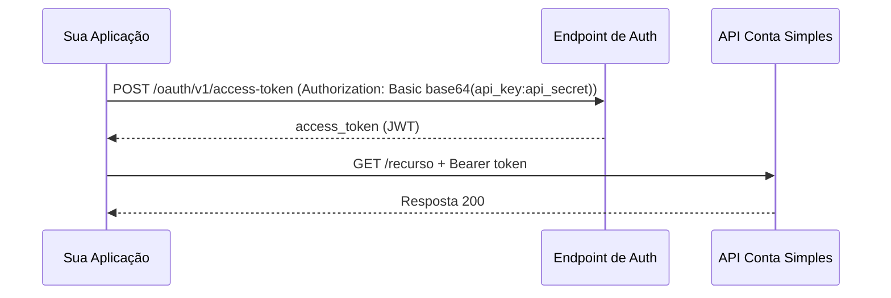

## Visão geral

A API Conta Simples utiliza **OAuth 2.0 Client Credentials** para autenticação. Este fluxo é ideal para comunicação server-to-server onde não há interação de usuário final.



---

## Obtendo o token

### Requisição

Faça uma requisição `POST` para o endpoint de token. As credenciais (API Key e API Secret obtidas no [Internet Banking](https://ib.contasimples.com/integracoes/api/credenciais)) devem ser enviadas no header `Authorization` em formato **Basic**: encode em base64 a string `API_KEY:API_SECRET` e use como valor do header.

```bash
# BASIC_BASE64 = "SUA_API_KEY:SEU_API_SECRET" encodado em base64
curl --location 'https://api-sandbox.contasimples.com/oauth/v1/access-token' \
  --header "Authorization: Basic ${BASIC_BASE64}" \
  --header "Content-Type: application/x-www-form-urlencoded" \
  --data "grant_type=client_credentials"
```

<Callout kind="info">
  Para produção, substitua a URL base por `https://api.contasimples.com`.
</Callout>

### Resposta

```json
{
  "access_token": "eyJhbGciOiJSUzI1NiIsInR5cCI6IkpXVCJ9...",
  "token_type": "Bearer",
  "expires_in": 1800
}
```

| Campo          | Descrição                                |
| -------------- | ---------------------------------------- |
| `access_token` | Token JWT para autenticação nas chamadas |
| `token_type`   | Sempre `Bearer`                          |
| `expires_in`   | Tempo de vida do token em segundos       |

---

## Usando o token

Inclua o token em todas as requisições no header `Authorization`:

```bash
curl -X GET https://api-sandbox.contasimples.com/recurso \
  -H "Authorization: Bearer {TOKEN}" \
  -H "Content-Type: application/json"
```

<Callout kind="alert">
  **Nunca** exponha tokens em URLs, logs, ou código client-side. Tokens devem
  ser tratados como credenciais sensíveis.
</Callout>

---

## Expiração e renovação

### Ciclo de vida do token

<Steps>
  <Step title="Token emitido" titleType="p">
    Token válido por `expires_in` segundos (padrão: 1800 = 30 minutos).
  </Step>
  <Step title="Token próximo de expirar" titleType="p">
    Renove o token **antes** da expiração para evitar interrupções.
  </Step>
  <Step title="Token expirado" titleType="p">
    Requisições retornarão `401 Unauthorized`. Obtenha um novo token.
  </Step>
</Steps>

### Boas práticas de renovação

<ExpandableGroup>
  <Expandable title="Renovação proativa" default-open="false">
    Renove o token quando faltar ~10% do tempo de vida. Para um token de 30 minutos, renove aos 27 minutos.

    ```typescript
    // Exemplo conceitual
    if (tokenAge > expiresIn * 0.9) {
      await refreshToken();
    }
    ```

  </Expandable>
  <Expandable title="Cache do token" default-open="false">
    Armazene o token em cache (Redis, memória) para evitar múltiplas requisições de autenticação desnecessárias.
  </Expandable>
  <Expandable title="Tratamento de 401" default-open="false">
    Se receber `401`, invalide o cache, obtenha novo token e repita a requisição original.
  </Expandable>
</ExpandableGroup>

---

## Headers obrigatórios

Toda requisição autenticada deve incluir:

| Header          | Valor              | Descrição                      |
| --------------- | ------------------ | ------------------------------ |
| `Authorization` | `Bearer {TOKEN}`   | Token de acesso OAuth 2.0      |
| `Content-Type`  | `application/json` | Formato do corpo da requisição |

---

## Segurança

### Armazenamento de credenciais

<Tabs>
  <Tab title="Recomendado">
    - AWS Secrets Manager
    - HashiCorp Vault
    - Azure Key Vault
    - GCP Secret Manager
    - Variáveis de ambiente em runtime (não em código)
  </Tab>

  <Tab title="Evitar">
    - Hardcoded em código fonte
    - Arquivos `.env` commitados
    - Logs de aplicação
    - Repositórios Git (mesmo privados)
    - Planilhas ou documentos compartilhados
  </Tab>
</Tabs>

### Em caso de comprometimento

Se suas credenciais forem comprometidas:

1. **Imediatamente** acesse o [painel de credenciais](https://ib.contasimples.com/integracoes/api/credenciais) no Internet Banking e revogue as credenciais comprometidas
2. Gere novas credenciais pelo mesmo painel
3. Faça rotação em todos os ambientes
4. Investigue logs para identificar uso não autorizado
5. Se necessário, entre em contato com o [suporte](/operacao/suporte)

---

## Troubleshooting

<ExpandableGroup>
  <Expandable title="401 Unauthorized" default-open="false">
    **Causas comuns:**
    - Token expirado
    - Token malformado
    - Header `Authorization` ausente ou incorreto

    **Solução:** Obtenha um novo token e verifique o formato do header.

  </Expandable>
  <Expandable title="403 Forbidden" default-open="false">
    **Causas comuns:**
    - Escopo insuficiente para o recurso
    - Credenciais não autorizadas para o ambiente

    **Solução:** Verifique os escopos das suas credenciais com o time de suporte.

  </Expandable>
  <Expandable title="400 Bad Request no /oauth/v1/access-token" default-open="false">
    **Causas comuns:**
    - `grant_type` incorreto
    - API Key ou API Secret inválidos no header `Authorization: Basic`
    - Valor em base64 malformado (deve ser `API_KEY:API_SECRET` encodado)

    **Solução:** Verifique o header `Authorization: Basic` e se o base64 está correto.

  </Expandable>
</ExpandableGroup>

---

## Próximos passos

<Columns cols="2">
  <Card
    title="Ambientes"
    icon="server"
    href="/comece-aqui/ambientes"
    horizontal={false}
  >
    Diferenças entre Sandbox e Produção.
  </Card>
  <Card
    title="Fluxo de Integração"
    icon="git-branch"
    href="/guias/fluxo-integracao"
    horizontal={false}
  >
    Próximas etapas após configurar a autenticação.
  </Card>
</Columns>
