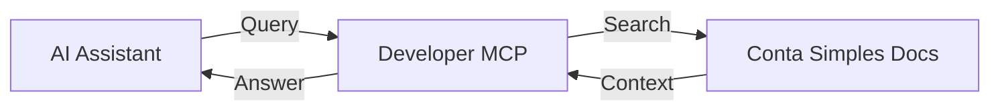

## Overview

The Developer MCP server gives AI agents direct access to the Conta Simples API documentation. It enables your AI assistant to understand endpoints, generate integration code, explain error responses, and help you build faster.

<Callout kind="info">
  The Developer MCP does **not** access live data or execute operations on the Conta Simples platform. It is a read-only documentation assistant designed to accelerate API integration.
</Callout>

---

## What you can do

Use the Developer MCP to ask your AI assistant questions like:

- "How do I authenticate with the Conta Simples API?"
- "Show me the request body for listing card transactions"
- "What scopes do I need to block a card?"
- "Generate a Python script to fetch banking statements"
- "What does error code 429 mean in the Conta Simples API?"
- "How does pagination work in the statements endpoint?"

The assistant will retrieve the relevant documentation and provide accurate, context-aware answers.

---

## Setup

<Callout kind="tip">
  No API keys or authentication are required for the Developer MCP. It provides public documentation access optimized for AI consumption.
</Callout>

<Tabs>
  <Tab title="Cursor" icon="mouse-pointer">
    Add the following to your MCP configuration in Cursor (Settings → Cursor Settings → MCP):

    ```json
    {
      "mcpServers": {
        "conta-simples-docs": {
          "url": "https://mcp.documentation.ai/contasimples"
        }
      }
    }
    ```
  </Tab>
  <Tab title="Claude Desktop" icon="bot">
    Add the following to your `claude_desktop_config.json`:

    ```json
    {
      "mcpServers": {
        "conta-simples-docs": {
          "url": "https://mcp.documentation.ai/contasimples"
        }
      }
    }
    ```
  </Tab>
  <Tab title="Windsurf" icon="wind">
    Add the MCP server in your Windsurf settings using the URL:

    ```
    https://mcp.documentation.ai/contasimples
    ```
  </Tab>
</Tabs>

---

## Available capabilities

The Developer MCP exposes the Conta Simples API documentation as structured context that AI agents can query. This includes:

| Capability | Description |
|-----------|-------------|
| **Endpoint discovery** | Find and understand all available API endpoints |
| **Parameter reference** | Get details on request parameters, types, and requirements |
| **Response schemas** | Understand response structures and field descriptions |
| **Authentication guides** | Learn how OAuth 2.0 and token management work |
| **Code generation** | Generate integration code in multiple languages |
| **Error diagnosis** | Understand error codes and troubleshooting steps |
| **Best practices** | Get recommendations for pagination, retry logic, and more |

---

## Example interactions

### Understanding an endpoint

**You:** "What parameters does the card transactions endpoint accept?"

**Assistant:** The `POST /statements/v1/credit-card` endpoint accepts the following parameters in the request body:

| Parameter | Type | Required | Description |
|-----------|------|----------|-------------|
| `startDate` | string | Yes | Start date in `YYYY-MM-DD` format |
| `endDate` | string | Yes | End date in `YYYY-MM-DD` format |
| `limit` | integer | Yes | Results per page (5 to 100) |
| `nextPageStartKey` | string | No | Cursor for pagination |

### Generating integration code

**You:** "Generate a Node.js function to authenticate and fetch card transactions"

The assistant will produce a complete, runnable code sample using the correct endpoints, authentication flow, and error handling based on the official documentation.

---

## How it works



1. Your AI assistant sends a query to the Developer MCP server
2. The MCP server searches the Conta Simples API documentation
3. Relevant documentation sections are returned as structured context
4. The AI assistant uses this context to provide accurate answers

---

## Limitations

- The Developer MCP provides **documentation only** — it cannot execute API calls or access live data
- Information reflects the current published documentation
- For operational actions, use the [Conta Simples MCP](/mcp/conta-simples-mcp) instead

---

## Next steps

<Columns cols="2">
  <Card
    title="Conta Simples MCP"
    icon="bot"
    href="/mcp/conta-simples-mcp"
    horizontal={false}
  >
    Execute real operations on the Conta Simples platform with AI agents.
  </Card>
  <Card
    title="API Quickstart"
    icon="zap"
    href="/comece-aqui/quickstart"
    horizontal={false}
  >
    Get your first API call working in 5 minutes.
  </Card>
</Columns>
